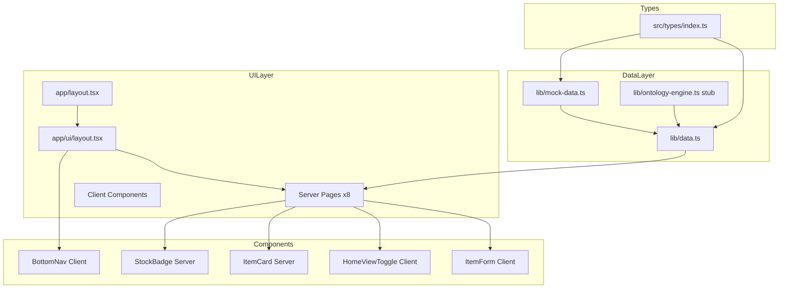
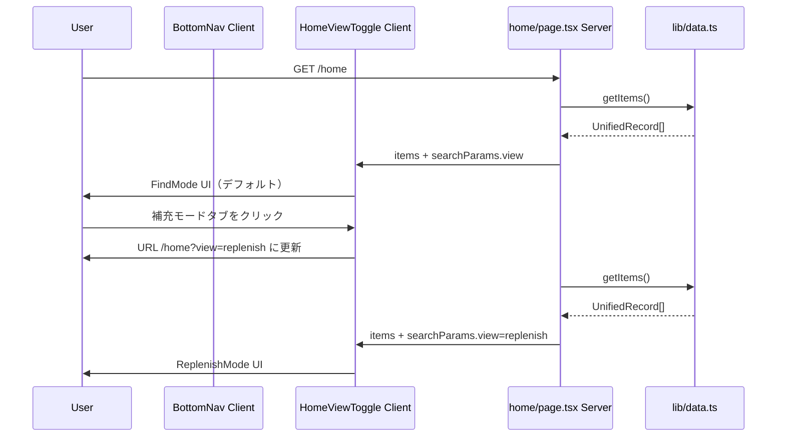
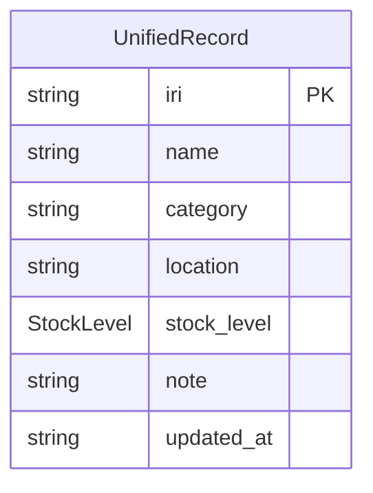

# Design Document: ui-mockup

## Overview

このフィーチャーは、integrate-management（App③）のモックアップフェーズとして、静的モックデータを用いた全8画面の UI を Next.js 16.2.6 App Router で実装する。実接続前に UI/UX を検証・確定することが目的であり、Vercel に即座にデプロイして家族全員がレビューできる状態を作る。

**Purpose**: 静的モックデータで I-01〜I-08 の全 UI を動作させ、実接続フェーズへの移行コストをゼロに近づける。  
**Users**: 夫（探すモード I-01）・妻（補充モード I-02）が主要ユーザー。開発者は Vercel Preview でレビュー・承認を行う。  
**Impact**: `src/app/page.tsx`（デフォルト画面）を置き換え、8 ルートと共通コンポーネントを新設する。

### Goals
- 全 8 画面（I-01〜I-08）が Vercel で閲覧可能な状態にする
- `lib/data.ts` を唯一の切り替え点として、環境変数 1 つで実接続へ移行できる構造を確立する
- TypeScript strict mode / no `any` / `npm run lint` エラーゼロ

### Non-Goals
- App①・App② への実 API 接続（実接続フェーズ）
- 認証・認可（実接続フェーズ）
- `lib/ontology-engine.ts` の実ロジック（実接続フェーズ）
- 重複マージ操作の実行、`days_remaining` 予測

---

## Boundary Commitments

### This Spec Owns
- `src/types/index.ts` — `UnifiedRecord` 型の定義と安定化
- `lib/mock-data.ts` — 静的モックデータの内容と型適合保証
- `lib/data.ts` — データアクセスインターフェース（`getItems` / `getItem`）と環境変数分岐ロジック
- `src/app/(ui)/` 配下の全ページと共通レイアウト
- `src/components/` の共通 UI コンポーネント（BottomNav・StockBadge・ItemCard・ItemForm）

### Out of Boundary
- `lib/ontology-engine.ts` の実装（実接続フェーズの spec で対応）
- `ontologies/*.yaml` の内容（dictionary-driven-mapping spec）
- Provider API への通信ロジック
- 認証フロー・セッション管理

### Allowed Dependencies
- Next.js 16.2.6（App Router）
- React 19.2.4
- Tailwind CSS v4（`@tailwindcss/postcss` 経由）
- `next/font/google`（Geist フォント）
- TypeScript 5 strict mode

### Revalidation Triggers
- `UnifiedRecord` 型のフィールド追加・変更 → 全コンポーネントの props 型を再確認
- `lib/data.ts` のインターフェース変更 → 実接続フェーズの `ontology-engine.ts` 連携に影響
- ルート構造変更 → BottomNav のアクティブ状態ロジックを更新

---

## Architecture

### Architecture Pattern & Boundary Map



**Architecture Integration**:
- **Route Group パターン** — `src/app/(ui)/` でボトムナビ付きレイアウトを全 8 画面に適用。URL には影響しない
- **データアクセス層集約** — `lib/data.ts` が `NEXT_PUBLIC_USE_MOCK` を読み、`mock-data.ts` か `ontology-engine.ts` を選択する唯一の分岐点
- **Server / Client 境界** — ページはすべて Server Component。`usePathname`・`useSearchParams`・form state を必要とするコンポーネントのみ `"use client"`
- **依存方向**: `Types → DataLayer → Pages → Components`（逆方向 import 禁止）

### Technology Stack

| Layer | Choice / Version | Role | Notes |
|-------|-----------------|------|-------|
| Framework | Next.js 16.2.6 App Router | ルーティング・SSR・ビルド | `node_modules/next/dist/docs/` 参照必須 |
| UI Runtime | React 19.2.4 | コンポーネントレンダリング | Server / Client Component 分割 |
| Styling | Tailwind CSS v4 | ユーティリティ CSS | `@tailwindcss/postcss` 経由、v3 と設定形式が異なる |
| Language | TypeScript 5 strict | 型安全性 | `any` 禁止・`strict: true` |
| Font | next/font/google (Geist) | フォント読み込み | layout.tsx で CSS 変数として定義済み |
| Deploy | Vercel | ホスティング | `NEXT_PUBLIC_USE_MOCK=true` を環境変数に設定 |

---

## File Structure Plan

### Directory Structure

```
src/
├── app/
│   ├── layout.tsx                    # 既存 Root Layout（メタデータ更新のみ）
│   ├── page.tsx                      # / → /home へリダイレクト（既存を置換）
│   └── (ui)/
│       ├── layout.tsx                # 共通 UILayout（BottomNav を含む）
│       ├── home/
│       │   └── page.tsx              # I-01/I-02: Find/Replenish モード
│       ├── shopping/
│       │   └── page.tsx              # I-04: 買い物リスト
│       ├── items/
│       │   ├── new/
│       │   │   └── page.tsx          # I-06: 新規登録
│       │   └── [iri]/
│       │       ├── page.tsx          # I-03: アイテム詳細
│       │       └── edit/
│       │           └── page.tsx      # I-07: 編集
│       ├── duplicates/
│       │   └── page.tsx              # I-05: 重複検出
│       └── settings/
│           └── page.tsx              # I-08: 設定
├── components/
│   ├── BottomNav.tsx                 # "use client" — usePathname でアクティブ管理
│   ├── HomeViewToggle.tsx            # "use client" — useSearchParams でビュー切り替え
│   ├── ItemCard.tsx                  # Server Component — アイテム行表示
│   ├── ItemForm.tsx                  # "use client" — 登録・編集フォーム（I-06/I-07 共用）
│   └── StockBadge.tsx                # Server Component — stock_level カラーバッジ
├── lib/
│   ├── mock-data.ts                  # 静的 UnifiedRecord[] データ
│   ├── data.ts                       # データアクセス層（env var 分岐）
│   └── ontology-engine.ts            # stub（モックアップ段階）
└── types/
    └── index.ts                      # UnifiedRecord 型定義
```

### Modified Files
- `src/app/layout.tsx` — メタデータを App③ 用に更新
- `src/app/page.tsx` — `/home` へのリダイレクトに置換

---

## System Flows

### ホーム画面ビュー切り替えフロー



---

## Requirements Traceability

| Requirement | Summary | Components | Contracts |
|-------------|---------|------------|-----------|
| 1.1–1.7 | 型定義・モックデータ・env 分岐 | `types/index.ts`, `lib/mock-data.ts`, `lib/data.ts` | DataAccessService |
| 2.1–2.5 | 共通レイアウト・ナビ | `(ui)/layout.tsx`, `BottomNav` | — |
| 3.1–3.5 | I-01 Find Mode | `home/page.tsx`, `HomeViewToggle`, `ItemCard`, `StockBadge` | — |
| 4.1–4.5 | I-02 Replenish Mode | `home/page.tsx`, `HomeViewToggle`, `ItemCard`, `StockBadge` | — |
| 5.1–5.5 | I-03 アイテム詳細 | `items/[iri]/page.tsx`, `StockBadge` | — |
| 6.1–6.5 | I-04 買い物リスト | `shopping/page.tsx`, `ItemCard`, `StockBadge` | — |
| 7.1–7.4 | I-05 重複検出 | `duplicates/page.tsx` | — |
| 8.1–8.4 | I-06 新規登録 | `items/new/page.tsx`, `ItemForm` | — |
| 9.1–9.4 | I-07 編集 | `items/[iri]/edit/page.tsx`, `ItemForm` | — |
| 10.1–10.3 | I-08 設定 | `settings/page.tsx` | — |
| 11.1–11.4 | Vercel デプロイ | 全ファイル・環境変数 | — |
| 12.1–12.5 | 非機能要件 | 全ファイル | DataAccessService |

---

## Components and Interfaces

### コンポーネント概要

| Component | Layer | Intent | Req | Key Dependencies | Contracts |
|-----------|-------|--------|-----|-----------------|-----------|
| `UnifiedRecord` 型 | Types | 統合ビューの型定義 | 1.1 | — | State |
| `lib/data.ts` | Data | env 分岐データアクセス | 1.5–1.7 | mock-data.ts, engine stub | Service |
| `lib/mock-data.ts` | Data | 静的モックデータ | 1.2–1.4 | types/index.ts | State |
| `BottomNav` | UI/Client | ナビゲーション | 2.1–2.2 | usePathname | — |
| `HomeViewToggle` | UI/Client | Find/Replenish タブ切り替え | 3.1, 4.1 | useSearchParams | — |
| `StockBadge` | UI/Server | stock_level バッジ表示 | 3.3, 4.3 | — | — |
| `ItemCard` | UI/Server | アイテム行表示 | 3.2–3.4, 4.2 | StockBadge | — |
| `ItemForm` | UI/Client | 登録・編集フォーム | 8.1–8.4, 9.1–9.4 | — | — |

---

### Data Layer

#### `src/types/index.ts`

| Field | Detail |
|-------|--------|
| Intent | `UnifiedRecord` 型および関連ユーティリティ型の単一の定義元 |
| Requirements | 1.1 |

**Responsibilities & Constraints**
- `UnifiedRecord` のフィールド型を完全に定義する。他のファイルで再定義しない
- `StockLevel` は文字列リテラルユニオン型として定義し、比較可能にする

**Contracts**: State [x]

##### State Management
```typescript
export type StockLevel = 'full' | 'ok' | 'low' | 'empty';

export interface UnifiedRecord {
  iri: string;
  name: string;
  category: string;
  location: string;
  stock_level: StockLevel;
  note: string;
  updated_at: string; // ISO 8601
}
```

---

#### `lib/data.ts`

| Field | Detail |
|-------|--------|
| Intent | データソース（mock / engine）への単一アクセス点。env var で分岐 |
| Requirements | 1.5, 1.6, 1.7 |

**Responsibilities & Constraints**
- `NEXT_PUBLIC_USE_MOCK === 'true'` のとき `lib/mock-data.ts` を返す
- それ以外のとき `lib/ontology-engine.ts` の関数を呼ぶ（モックアップ段階は stub）
- Server Component から呼ばれる非同期関数として定義する

**Dependencies**
- Outbound: `lib/mock-data.ts` — モックデータ取得 (P0)
- Outbound: `lib/ontology-engine.ts` — 実接続フェーズのデータ取得 (P1)

**Contracts**: Service [x]

##### Service Interface
```typescript
// lib/data.ts
export async function getItems(): Promise<UnifiedRecord[]>;
export async function getItem(iri: string): Promise<UnifiedRecord | null>;
```
- Preconditions: `NEXT_PUBLIC_USE_MOCK` 環境変数が `.env.local` に定義されている
- Postconditions: `UnifiedRecord[]` または `UnifiedRecord | null` を返す。例外は throw しない（空配列または null）
- Invariants: 返却データは必ず `UnifiedRecord` 型に適合する

---

#### `lib/mock-data.ts`

| Field | Detail |
|-------|--------|
| Intent | テスト用途の静的 `UnifiedRecord[]` データ |
| Requirements | 1.2, 1.3, 1.4 |

**Responsibilities & Constraints**
- `UnifiedRecord[]` 型の名前付き export `MOCK_ITEMS` を提供する
- 最低 10 件、`stock_level` の全4値（full/ok/low/empty）を含む
- 重複ペア（`name` 一致・`iri` 不一致）を最低 1 ペア含む
- コンポーネントから直接 import されない（`lib/data.ts` 経由のみ）

**Contracts**: State [x]

```typescript
// lib/mock-data.ts
import type { UnifiedRecord } from '@/types';

export const MOCK_ITEMS: UnifiedRecord[] = [
  // ... 最低 10 件
];
```

---

### UI Components

#### `components/BottomNav.tsx`

| Field | Detail |
|-------|--------|
| Intent | 全画面共通のボトムナビゲーション（Client Component） |
| Requirements | 2.1, 2.2 |

**Responsibilities & Constraints**
- `"use client"` — `usePathname` でアクティブ状態を判定する
- ナビ項目: ホーム（`/home`）・買い物（`/shopping`）・設定（`/settings`）
- `(ui)/layout.tsx` が唯一のマウント箇所

```typescript
// Server-passable props — data does not come from client fetch
export interface BottomNavProps {
  // 追加 props なし — pathname は内部で usePathname() から取得
}
```

---

#### `components/HomeViewToggle.tsx`

| Field | Detail |
|-------|--------|
| Intent | Find Mode / Replenish Mode のタブ切り替え UI（Client Component） |
| Requirements | 3.1, 3.5, 4.1, 4.5 |

**Responsibilities & Constraints**
- `"use client"` — `useSearchParams` で `?view=find|replenish` を読む
- `items` を props として受け取り、`view` に応じてソート・グループ化して描画する
- URL 変更は `router.push('/home?view=...')` で行う

```typescript
export interface HomeViewToggleProps {
  items: UnifiedRecord[];
}
```

---

#### `components/ItemCard.tsx`

| Field | Detail |
|-------|--------|
| Intent | アイテム一覧行の表示（Server Component） |
| Requirements | 3.2–3.4, 4.2, 6.2, 6.5 |

**Implementation Notes**
- `href` は `encodeURIComponent(iri)` で生成する
- `StockBadge` を子として使用

```typescript
export interface ItemCardProps {
  item: UnifiedRecord;
  showLocation?: boolean; // Replenish Mode と Shopping で表示
}
```

---

#### `components/StockBadge.tsx`

| Field | Detail |
|-------|--------|
| Intent | `stock_level` に応じた色付きバッジ（Server Component） |
| Requirements | 3.3, 4.3, 4.4 |

```typescript
export interface StockBadgeProps {
  level: StockLevel;
}
```

色マッピング:
- `empty` → 赤（`bg-red-100 text-red-700`）
- `low` → 黄（`bg-yellow-100 text-yellow-700`）
- `ok` → 緑（`bg-green-100 text-green-700`）
- `full` → グレー（`bg-zinc-100 text-zinc-500`）

---

#### `components/ItemForm.tsx`

| Field | Detail |
|-------|--------|
| Intent | 新規登録（I-06）・編集（I-07）で共用するフォーム（Client Component） |
| Requirements | 8.1–8.4, 9.1–9.4, 12.4 |

**Responsibilities & Constraints**
- `"use client"` — controlled inputs で form state を管理
- `mode: 'create' | 'edit'` prop でラベル・送信文言を切り替える
- `initialData` で編集時のプリフィル値を受け取る
- 送信時はモックフィードバック（`alert` またはトースト）を表示し、ルーター遷移する
- `name` 必須バリデーション — submit 前にクライアント側で検証

```typescript
export interface ItemFormProps {
  mode: 'create' | 'edit';
  initialData?: Partial<UnifiedRecord>;
  onSubmit?: (data: Omit<UnifiedRecord, 'iri' | 'updated_at'>) => void;
}
```

---

## Data Models

### Domain Model



`UnifiedRecord` はモックアップフェーズにおけるルート集約体。複数の Provider から結合されたビューを表すが、モック段階では単一のフラット配列として扱う。

### Data Contracts & Integration

- `lib/data.ts` の `getItems()` / `getItem(iri)` が唯一のデータ取得インターフェース
- モックアップ段階では同期的な配列参照。実接続フェーズで `async fetch` に切り替え
- 全画面は `UnifiedRecord` 型に依存 — フィールド追加は全画面に波及する

---

## Error Handling

### Error Strategy

モックアップフェーズのエラーはシンプルに対処する。実接続フェーズで graceful-degradation spec が詳細を担う。

### Error Categories and Responses

| カテゴリ | 条件 | 対応 |
|---------|------|------|
| Not Found | `getItem(iri)` が `null` を返す | エラーメッセージ + 戻りリンクを表示（5.4、9.4） |
| Empty State | フィルタ結果が 0 件 | 空状態メッセージを表示（6.4、7.4） |
| Validation | `name` が空で submit | クライアント側エラーメッセージ表示（8.2） |
| Mock-only | 実データ操作 | 「実接続フェーズで実装予定」トースト（8.3、9.3、7.3） |

---

## Testing Strategy

### Unit Tests
- `lib/data.ts` — `NEXT_PUBLIC_USE_MOCK=true` / `false` での分岐動作
- `StockBadge` — 全 4 stock_level 値に対するクラス名出力
- `ItemForm` — `name` 空での submit 時バリデーションエラー表示

### Integration Tests
- `/home?view=find` — location グループ数・アイテム数の一致確認
- `/home?view=replenish` — stock_level 優先度順のソート確認
- `/shopping` — `stock_level` が `low`/`empty` のみが表示されること
- `/duplicates` — `name` 一致・`iri` 不一致ペアの検出件数確認

### Build / Lint Tests
- `npm run build` エラーゼロ（Req 11.1）
- `npm run lint` 警告・エラーゼロ（Req 11.2）
- TypeScript コンパイルエラーゼロ（Req 12.1）

---

## Security Considerations

モックアップフェーズは認証なし・公開データのみ。センシティブな情報を含むモックデータを作成しない。`NEXT_PUBLIC_` 環境変数はクライアントに公開されることを認識し、接続先 URL 等の秘匿情報を設定しない。
